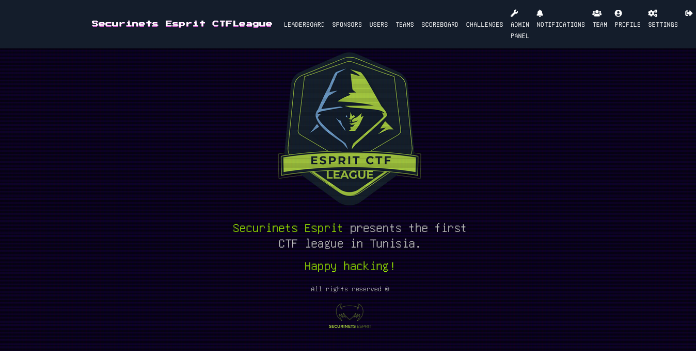
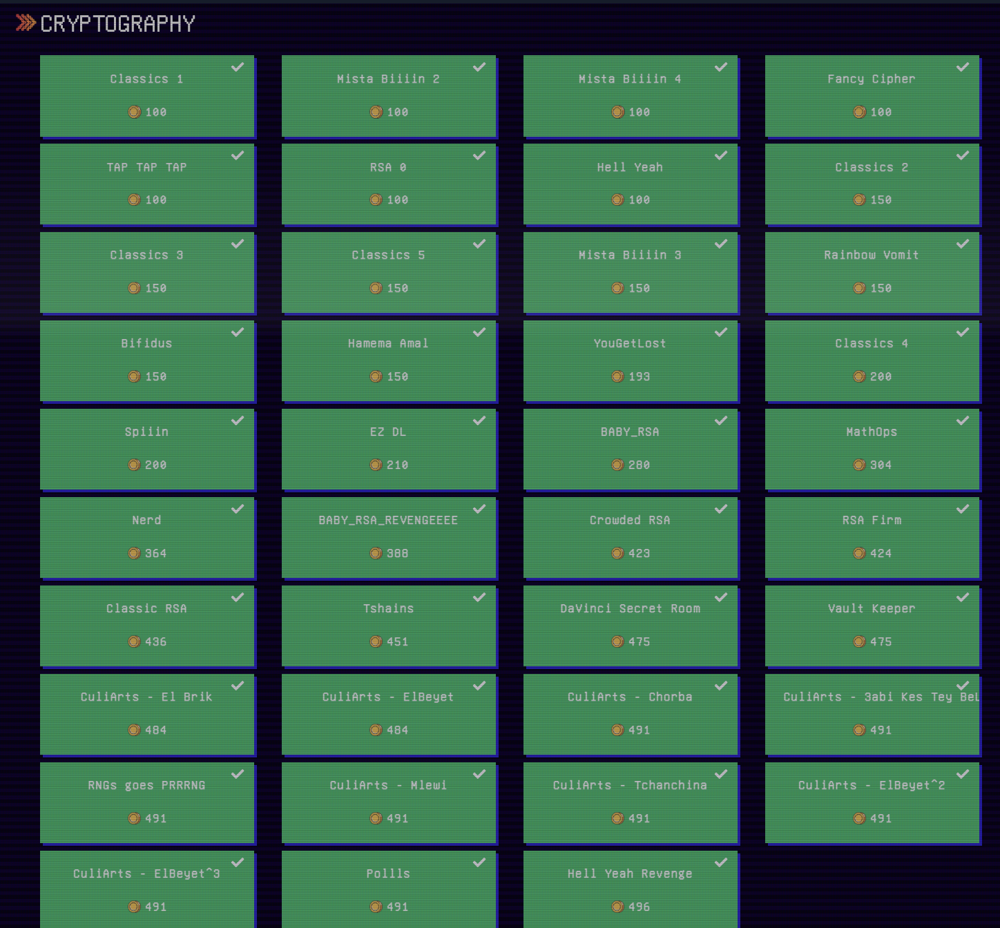
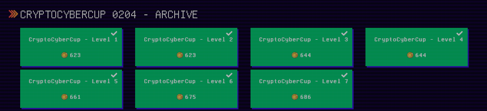

# Securinets ESPRIT - Cyber League CTF 2022

I was honored by the invitation of @iwd to write Cryptography related challenges for the first edition of the Tunisian Cyber League CTF organized by Securinets ESPRIT. 

I managed to write more than 35 cryptography task and 1 CryptoCyberCup for 3 months of competition. 

You find in this repo the most ineteresting tasks: Source code along with the deploiement templates including Dockerfiles and xinetd configurations for any further challenges. You can find also the description of each task, its points and the number of solves.

